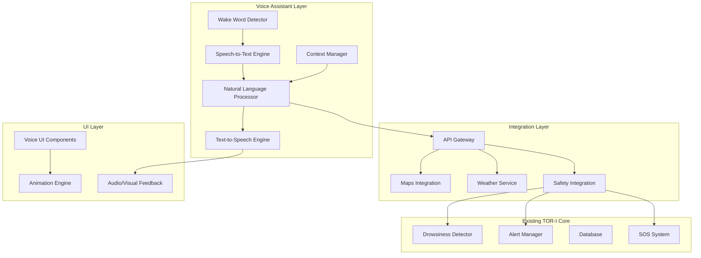

# Design Document

## Overview

This document outlines the design for "Tori", a hands-free voice assistant integrated into the TOR-I travel safety application. Tori will function as an intelligent driving companion similar to JARVIS/F.R.I.D.A.Y, providing natural voice interaction, context-aware suggestions, and seamless integration with existing safety monitoring systems.

The design emphasizes safety-first architecture, ensuring voice interactions never compromise the primary drowsiness detection and emergency response capabilities. Tori will enhance the driving experience through proactive assistance while maintaining the app's core safety mission.

## Architecture

### High-Level Architecture



### Component Architecture

The voice assistant follows a modular architecture with clear separation of concerns:

1. **Voice Processing Pipeline**: Wake word detection → Speech recognition → Intent processing → Response generation
2. **Integration Services**: Connects to maps, weather, and existing TOR-I safety systems
3. **Context Management**: Maintains conversation state and user preferences
4. **UI/UX Layer**: Provides visual feedback and animations
5. **Safety Integration**: Ensures voice features complement existing safety monitoring

## Components and Interfaces

### 1. Wake Word Detection Engine

**Technology Stack:**
- Primary: [Picovoice Porcupine](https://picovoice.ai/) for offline wake word detection
- Fallback: Custom TensorFlow Lite model for "Hey Tor" detection
- Audio processing: Android AudioRecord API with noise cancellation

**Interface:**
```kotlin
interface WakeWordDetector {
    fun startListening()
    fun stopListening()
    fun setWakeWordCallback(callback: (confidence: Float) -> Unit)
    fun updateSensitivity(level: Float)
    fun isListening(): Boolean
}
```

**Key Features:**
- Continuous background listening with minimal battery impact
- Adjustable sensitivity based on driving conditions
- Noise cancellation for in-vehicle environment
- False positive reduction through confidence thresholding

### 2. Speech Recognition Engine

**Technology Stack:**
- Primary: Google Cloud Speech-to-Text API for high accuracy
- Offline: Android SpeechRecognizer for network-limited scenarios
- Streaming recognition for real-time processing

**Interface:**
```kotlin
interface SpeechRecognizer {
    fun startRecognition(callback: SpeechCallback)
    fun stopRecognition()
    fun setLanguage(locale: Locale)
    fun enableOfflineMode(enabled: Boolean)
}

interface SpeechCallback {
    fun onSpeechStart()
    fun onPartialResult(text: String)
    fun onFinalResult(text: String, confidence: Float)
    fun onError(error: SpeechError)
}
```

### 3. Natural Language Processing Engine

**Technology Stack:**
- Intent Classification: Google Dialogflow or custom BERT-based model
- Entity Extraction: Named Entity Recognition for locations, times, etc.
- Context Management: Custom implementation with conversation memory

**Interface:**
```kotlin
interface NLPEngine {
    suspend fun processIntent(text: String, context: ConversationContext): IntentResult
    fun updateContext(context: ConversationContext)
    fun clearContext()
}

data class IntentResult(
    val intent: Intent,
    val entities: Map<String, Any>,
    val confidence: Float,
    val requiresFollowUp: Boolean
)

enum class Intent {
    NAVIGATION, FIND_PLACE, WELLNESS_CHECK, EMERGENCY,
    WEATHER_QUERY, TRAFFIC_QUERY, GENERAL_INFO, UNKNOWN
}
```

### 4. Text-to-Speech Engine

**Technology Stack:**
- Primary: Google Cloud Text-to-Speech with Neural2 voices
- Offline: Android TextToSpeech API
- Voice customization for consistent Tori personality

**Interface:**
```kotlin
interface TTSEngine {
    suspend fun speak(text: String, priority: Priority = Priority.NORMAL)
    fun setVoiceParameters(speed: Float, pitch: Float)
    fun setPersonality(personality: VoicePersonality)
    fun stopSpeaking()
    fun isSpeaking(): Boolean
}

enum class VoicePersonality {
    FRIENDLY, PROFESSIONAL, URGENT, CALM
}
```

### 5. Context Manager

**Responsibilities:**
- Maintain conversation history (last 3 interactions)
- Store user preferences and frequently used locations
- Track current driving state and safety context
- Manage session lifecycle

**Interface:**
```kotlin
interface ContextManager {
    fun addInteraction(interaction: Interaction)
    fun getRecentContext(): List<Interaction>
    fun updateUserPreferences(preferences: UserPreferences)
    fun getCurrentDrivingState(): DrivingState
    fun clearSession()
}

data class ConversationContext(
    val recentInteractions: List<Interaction>,
    val userPreferences: UserPreferences,
    val currentLocation: Location?,
    val drivingState: DrivingState,
    val safetyStatus: SafetyStatus
)
```

### 6. Voice UI Components

**Design System:**
- Neumorphic design with soft shadows and rounded edges
- Dark theme with neon-blue accent colors (#00E5FF)
- Responsive animations based on voice interaction states
- Accessibility-compliant contrast ratios

**Key Components:**
```kotlin
class VoiceVisualizerView : View {
    fun showIdleState() // Soft heartbeat glow
    fun showListeningState() // Bright pulsating glow
    fun showProcessingState() // Rotating ripple effect
    fun showWaveform(audioData: FloatArray) // Real-time waveform
}

class ToriAvatarView : View {
    fun animateActivation()
    fun showThinkingAnimation()
    fun showSpeakingAnimation()
    fun showErrorState()
}
```

### 7. Integration Services

**Maps Integration:**
```kotlin
interface MapsService {
    suspend fun findNearbyPlaces(query: String, location: Location): List<Place>
    suspend fun getDirections(destination: Place): Route
    suspend fun getCurrentLocation(): Location
    suspend fun getTrafficInfo(route: Route): TrafficInfo
}
```

**Weather Integration:**
```kotlin
interface WeatherService {
    suspend fun getCurrentWeather(location: Location): WeatherInfo
    suspend fun getWeatherAlerts(location: Location): List<WeatherAlert>
}
```

**Safety Integration:**
```kotlin
interface SafetyIntegration {
    fun getCurrentSafetyStatus(): SafetyStatus
    fun triggerWellnessCheck(type: WellnessType)
    fun activateEnhancedMonitoring()
    fun logVoiceInteraction(interaction: VoiceInteraction)
}
```

## Data Models

### Core Data Models

```kotlin
data class VoiceInteraction(
    val id: String,
    val timestamp: Long,
    val userInput: String,
    val intent: Intent,
    val response: String,
    val actionTaken: String?,
    val drivingContext: DrivingState,
    val safetyRelevant: Boolean
)

data class UserPreferences(
    val preferredLanguage: Locale,
    val voiceSpeed: Float,
    val homeLocation: Location?,
    val workLocation: Location?,
    val frequentDestinations: List<Place>,
    val wellnessSettings: WellnessSettings
)

data class DrivingState(
    val isActive: Boolean,
    val currentSpeed: Float?,
    val currentLocation: Location?,
    val destination: Place?,
    val routeProgress: Float?,
    val trafficConditions: TrafficConditions
)

data class Place(
    val id: String,
    val name: String,
    val address: String,
    val location: Location,
    val rating: Float?,
    val facilities: List<Facility>,
    val distance: Float,
    val estimatedTravelTime: Int
)

enum class Facility {
    RESTROOM, RESTAURANT, FUEL_STATION, PARKING, 
    MEDICAL, WIFI, ATM, CHARGING_STATION
}

data class SafetyStatus(
    val drowsinessLevel: Float,
    val alertsActive: Boolean,
    val lastAlertTime: Long?,
    val tripDuration: Long,
    val recommendsBreak: Boolean
)
```

### Database Schema Extensions

```kotlin
@Entity(tableName = "voice_interactions")
data class VoiceInteractionEntity(
    @PrimaryKey val id: String,
    val timestamp: Long,
    val userInput: String,
    val intent: String,
    val response: String,
    val actionTaken: String?,
    val tripLogId: Long?,
    val safetyRelevant: Boolean
)

@Entity(tableName = "user_preferences")
data class UserPreferencesEntity(
    @PrimaryKey val id: Int = 1,
    val preferredLanguage: String,
    val voiceSpeed: Float,
    val homeLatitude: Double?,
    val homeLongitude: Double?,
    val workLatitude: Double?,
    val workLongitude: Double?
)

@Entity(tableName = "frequent_destinations")
data class FrequentDestinationEntity(
    @PrimaryKey val id: String,
    val name: String,
    val address: String,
    val latitude: Double,
    val longitude: Double,
    val visitCount: Int,
    val lastVisited: Long
)
```

## Correctness Properties

*A property is a characteristic or behavior that should hold true across all valid executions of a system-essentially, a formal statement about what the system should do. Properties serve as the bridge between human-readable specifications and machine-verifiable correctness guarantees.*

Now I'll analyze the acceptance criteria to determine which ones can be tested as properties:

### Property Reflection

After reviewing all the properties identified in the prework analysis, I've identified several areas where properties can be consolidated to eliminate redundancy and improve testing efficiency:

**Consolidation Opportunities:**
- Properties 1.1, 1.2, 1.3 can be combined into a comprehensive wake word response property
- Properties 7.1, 7.2, 7.3, 7.4 can be combined into a single UI state management property
- Properties 2.1, 2.2, 2.3, 2.4 can be consolidated into a comprehensive intent processing property
- Properties 6.1, 6.2, 6.5 can be combined into a driving mode adaptation property
- Properties 9.1, 9.2, 9.3 can be consolidated into a speech processing reliability property

**Unique Value Properties:**
Each remaining property provides distinct validation value for different aspects of the system, from safety integration to context management to error handling.

### Correctness Properties

Property 1: Wake Word Response Completeness
*For any* wake word detection event, the system should activate listening mode within 500ms, display appropriate UI feedback, and provide audio confirmation
**Validates: Requirements 1.1, 1.2, 1.3**

Property 2: Intent Processing Accuracy
*For any* natural language input after wake word activation, the system should correctly identify the intent type and extract relevant entities with appropriate confidence scoring
**Validates: Requirements 2.1, 2.2, 2.3, 2.4**

Property 3: Context Retention Limits
*For any* conversation session, the context manager should maintain exactly the last 3 interactions and clear older context automatically
**Validates: Requirements 3.3, 10.1**

Property 4: Safety Priority Enforcement
*For any* situation where voice commands conflict with safety alerts, the system should prioritize safety functions over voice interactions
**Validates: Requirements 11.6**

Property 5: Driving Mode Adaptation
*For any* driving mode activation, the system should speak all results aloud, use large UI elements, and suppress non-critical notifications
**Validates: Requirements 6.1, 6.2, 6.6**

Property 6: Wellness Command Integration
*For any* wellness-related voice command (tired, hungry, sleepy), the system should trigger appropriate safety responses and log the event for analytics
**Validates: Requirements 5.1, 5.2, 5.3, 5.5**

Property 7: UI State Consistency
*For any* voice interaction state change (idle, listening, processing, speaking), the UI should display the corresponding visual feedback with consistent theming
**Validates: Requirements 7.1, 7.2, 7.3, 7.4, 7.5, 7.6**

Property 8: Location Service Integration
*For any* location-based query, the system should integrate with Maps API and return results containing distance, ETA, ratings, and facility information
**Validates: Requirements 4.1, 4.2, 4.4, 3.5**

Property 9: Speech Processing Reliability
*For any* speech input, the system should achieve 95% accuracy in speech-to-text conversion and provide natural-sounding text-to-speech output
**Validates: Requirements 9.1, 9.2**

Property 10: Error Handling Consistency
*For any* system error or failure, the system should provide helpful error messages and gracefully degrade to essential functions
**Validates: Requirements 3.6, 12.1, 12.6**

Property 11: Preference Persistence
*For any* user preference expressed during voice interactions, the system should store the preference and apply it consistently in future interactions
**Validates: Requirements 10.2, 11.4**

Property 12: Proactive Monitoring Integration
*For any* change in traffic, weather, or road conditions, the continuous assistant should automatically announce relevant updates to the driver
**Validates: Requirements 8.1, 8.2, 8.3**

## Error Handling

### Error Categories and Responses

**1. Speech Recognition Errors**
- **Cause**: Background noise, unclear speech, microphone issues
- **Response**: "Sorry, I didn't get that. Could you repeat it?"
- **Fallback**: Increase microphone sensitivity, suggest quieter environment

**2. Network Connectivity Errors**
- **Cause**: Poor cellular/WiFi connection
- **Response**: Switch to offline mode, use cached data
- **Fallback**: Inform user of limited functionality, prioritize safety features

**3. API Service Errors**
- **Cause**: Maps API, Weather API, or TTS service failures
- **Response**: Use cached results, inform user of potential outdated information
- **Fallback**: Graceful degradation to basic functionality

**4. Intent Processing Errors**
- **Cause**: Ambiguous commands, unsupported requests
- **Response**: Ask clarifying questions, suggest alternative phrasings
- **Fallback**: Provide list of supported command examples

**5. Safety System Conflicts**
- **Cause**: Voice commands during critical safety alerts
- **Response**: Prioritize safety alerts, defer voice processing
- **Fallback**: Resume voice interaction after safety situation resolves

**6. Hardware Errors**
- **Cause**: Microphone access denied, speaker issues
- **Response**: Guide user through permission setup
- **Fallback**: Visual-only interaction mode

### Error Recovery Strategies

```kotlin
class ErrorHandler {
    fun handleSpeechRecognitionError(error: SpeechError): ErrorResponse {
        return when (error.type) {
            SpeechErrorType.NO_MATCH -> ErrorResponse.RETRY_WITH_PROMPT
            SpeechErrorType.NETWORK_ERROR -> ErrorResponse.SWITCH_TO_OFFLINE
            SpeechErrorType.AUDIO_ERROR -> ErrorResponse.CHECK_MICROPHONE
            else -> ErrorResponse.GENERIC_RETRY
        }
    }
    
    fun handleAPIError(service: APIService, error: APIError): ErrorResponse {
        return when (service) {
            APIService.MAPS -> useCachedLocationData()
            APIService.WEATHER -> useBasicWeatherInfo()
            APIService.TTS -> switchToSystemTTS()
        }
    }
}
```

## Testing Strategy

### Dual Testing Approach

The voice assistant will be validated through both unit testing and property-based testing to ensure comprehensive coverage:

**Unit Tests:**
- Specific command examples and edge cases
- Integration points between voice components and existing TOR-I systems
- Error conditions and fallback scenarios
- UI component behavior and animations

**Property Tests:**
- Universal properties across all voice interactions
- Comprehensive input coverage through randomization
- Safety integration scenarios
- Context management across conversation flows

### Property-Based Testing Configuration

**Testing Framework:** [Kotest Property Testing](https://kotest.io/docs/proptest/property-based-testing.html) for Kotlin
**Minimum Iterations:** 100 per property test
**Test Data Generation:**
- Speech input generators with various accents and speaking speeds
- Intent generators covering all supported command types
- Context state generators for conversation scenarios
- Error condition generators for failure testing

**Property Test Examples:**

```kotlin
class VoiceAssistantPropertyTests : StringSpec({
    
    "Property 1: Wake Word Response Completeness" {
        checkAll(Arb.wakeWordAudio()) { audioSample ->
            val startTime = System.currentTimeMillis()
            val result = wakeWordDetector.process(audioSample)
            val responseTime = System.currentTimeMillis() - startTime
            
            result.shouldBeActivated()
            responseTime shouldBeLessThan 500
            uiState.shouldShowListeningAnimation()
            audioFeedback.shouldHavePlayedConfirmation()
        }
    }
    
    "Property 3: Context Retention Limits" {
        checkAll(Arb.conversationSequence(minLength = 5)) { conversation ->
            conversation.forEach { interaction ->
                contextManager.addInteraction(interaction)
            }
            
            val recentContext = contextManager.getRecentContext()
            recentContext.size shouldBe 3
            recentContext shouldContain conversation.takeLast(3)
        }
    }
})
```

**Tag Format for Property Tests:**
```kotlin
// Feature: voice-assistant, Property 1: Wake Word Response Completeness
// Feature: voice-assistant, Property 3: Context Retention Limits
```

### Integration Testing Strategy

**Safety System Integration:**
- Test voice commands during active drowsiness monitoring
- Verify SOS integration with voice-triggered emergencies
- Validate alert prioritization when voice and safety systems conflict

**Maps and Location Integration:**
- Test location queries with various GPS accuracy levels
- Verify navigation integration with voice-guided directions
- Test offline fallback for location services

**UI/UX Integration:**
- Test voice UI animations across different device orientations
- Verify accessibility compliance for voice interactions
- Test neumorphic design consistency across different screen sizes

### Performance Testing

**Response Time Requirements:**
- Wake word detection: < 500ms
- Speech recognition: < 2 seconds
- Intent processing: < 1 second
- TTS response: < 3 seconds total

**Resource Usage Limits:**
- Battery impact: < 5% additional drain per hour
- Memory usage: < 100MB additional RAM
- CPU usage: < 10% average during active listening

**Stress Testing Scenarios:**
- Continuous 8-hour driving sessions
- High background noise environments
- Poor network connectivity conditions
- Rapid-fire voice commands

This comprehensive testing strategy ensures that Tori functions reliably as a safety-critical voice assistant while maintaining the premium user experience expected from a JARVIS-like companion.